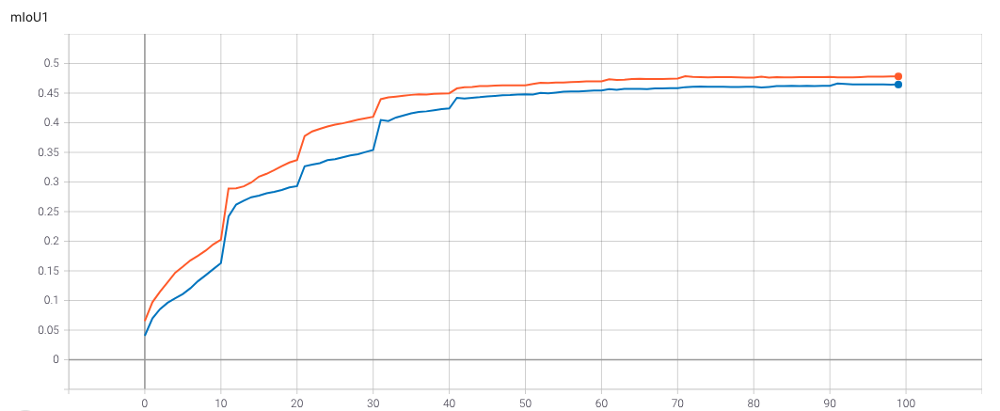

# Hierarchy Segmentation on Pascal Part Dataset
## Model high-level overview
The repository contains one of the hierarchical segmentation approaches. 
This work is a simplified reproduction of this work [work](https://arxiv.org/pdf/2203.14335.pdf).

Here we consider a model for segmentation consisting of 4 parts:
1. **_Encoder(Backbone):_**  The encoder is used to exract the feature maps from data.
Also, we can take the pretrained model on ImageNet. This allows one to increase the speed of convergence 
   of the segmentation model due to a pretrained set of features.
   In this work we consider ResNet family as encoders. The current implementation 
   supports standard (ResNet18, ResNet34, ResNet50, ResNet101, ResNet152). 
   The last Average Pooling and Linear Classificator is dropped.
2. **_Decoder:_** Given the embeddings from encoder, decoder and the following layers compute the the needed output(score vector for pixel classification). 
   The decoder is learned from scratch. In this work the Unet based Decoder is supported.
   Simply it is the right part of Unet model with 5 stages (upsamples).
3. **_Segmentation Head:_** In our case it is appended in Unet Decoder.  
4. **_Classification Head:_** In our case we consider only sigmoid activation on the output of Unet Decoder. 
### Data
We consider the Pascal-Part data in this project. The data consists from 10 classes with the following hierachy:

    ├── (0) background
    └── (7) body
        ├── upper_body (8)
        |   ├── (1) low_hand
        |   ├── (6) up_hand
        |   ├── (2) torso
        |   └── (4) head
        └── lower_body (9)
            ├── (3) low_leg
            └── (5) up_leg
The train size: 1,713 samples. 
### Metric
The mean intersection-over-union (mIoU) is adopted for evaluation. Particularly, we report
the average score, i.e., $mIoU^l$, for classes in each 
hierarchy level $l$ independently (3 levels: 7 classes (leaf nodes), 3 classes(body up/low), 2 classes(body/background)). Background IoU is not appended in final mIoU. So, the scores are expected to be smaller than in original paper. 
### Loss
Like in this [work](https://arxiv.org/pdf/2203.14335.pdf), we consider the BCE loss instead of CCE. 
The loss is based not only on 7 classes from level 1, but on all 10 classes.
Also, for improvement we consider the Tree-Min Loss.

## Installation
1. Clone repository:  ``` clone git@github.com:Balitskiy-Gleb/HSEG.git```
2. Go to root project directory ```HSEG```. 
3. To simple usage of configs, put the dataset in ```root_dir/data/pascal_part```
4. Create new conda environment named ```hseg_env``` via ```scripts/create_hseg_env.sh``` and activate it.
5. Run ```tools/dataset_hie_enc.py to create hierarchy encoded data(To speed up training).
## Project Structure 
1. All part of segmentation model contained in ```./models```. 
2. Encoders are in ```./models/encoders```. 
3. Decoders are in ```./models/decoders```.
4. Dataset, metric and loss implementation contained in ```./utils/```.
5. Train and eval managers are contained in ```./manage/```.
6. The main train function ```./train.py```.
7. The main eval function ```./evaluate.py```.
8. To create config modify and run ```./configs/config.py```. They are also stored in ```./configs/```
## Train 
1. Configure your model via modification of ```config.py```. The JSON config will be
   created and saved automatically in ```./configs/"config[exp_name]".json```.
2. Run the following command to start training: 
```
python3 train.py
```
Or one can use already saved config file, by running the following command:
```
python3 train.py --cfg PATH_TO_CONFIG
```
During training, the tensorboard logs will be saved in directory ```./tensorboard/"config["exp_name"]"```.
Model checkpoints will be save in ```./experiments/"config["exp_name"]"/models_checkpoints```.
Config duplicate will be saved in ```./experiments/"config["exp_name"]"/configs```.
### Evaluation
To produce predicted masks images and recompute scores for any state of model, please run the following script. 
```
python3 evaluate.py
```
or 
```
python3 train.py --cfg PATH_TO_CONFIG
```
The config used is the same as for train procedure. Only one need to fill the parameter ```config["eval_checkpoint"]```.
## Experiments Result: 
ince the objects in space are connected, that is, they have a hierarchy, it seems that using this hierarchy information during training we can improve the main metrics. The main problem is to feed this information to the model. One approach is to modify the loss function so that it penalizes more for not respecting the hierarchy. According to this principle, a tree-loss was formed based a hierarchy-coherent scores. Using $\mathcal{T}$-properties (see. [paper](https://www.semanticscholar.org/paper/MultiLabel-Classification-on-Tree-and-Hierarchies-Bi-Kwok/6853ac3b9a4d5fe940356e44e3cb99d84490a484])) author constructed new score vector (output of model), to penalize more for wrong prediction and not satisfying the hierarchy. This loss called Tree-Min Loss. We compare it to BCE Loss constructed for all classes in hierarchy.
We choose ResNet18 as the backbone(encoder). 
The decoder is based on Unet architecture. 
On  one can see the train loss for two compared loss fuctions. They are almost the same. In our opinion, it is due to the about equal proportion of $\mathcal{T}$ -positive and $\mathcal{T}$-negative paths, and so the loss is modified in two directions. The $mIoU^1$, $mIoU^2$ and $mIoU^3$ are presented on , ,.
You can see that Tree-Min Loss appeared to be worse for multiclass (level 1) classification, even having the same $mIoU^3$ score on body/background labeling. This tells us that with our parameters and segmentation model, tree-min loss does not allow for better segmentation. But, also let's look on the samples. 


The main expected result of this methods is to impove semantic segmention using the hierarchy infromation. The idea is that the . 


